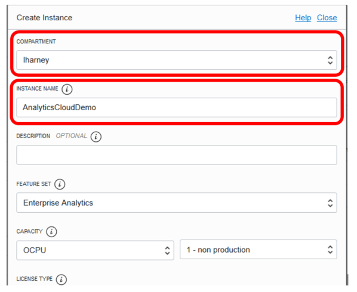
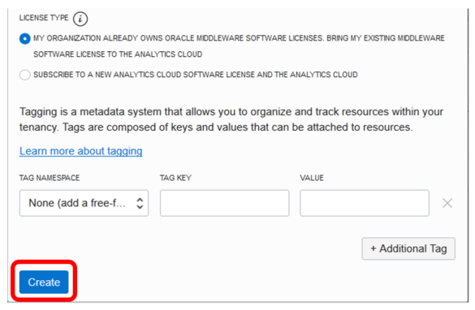

## Lab 0 – Create an Oracle Analytics Cloud (OAC) instance

Once logged in, you can see all the services available to you. Click on the navigation menu in the upper left for showing up all the navigation choices and click on Platform Services -> Analytics

Click _Create Instance_

And then compile all the following fields:
- For _Instance, Name,_ enter a name for your service instance.
- For _Notification Email_, enter the email address of the person you want to notify when this service is ready to use and receive other status updates about this service in the future.
- If several geographical regions are available to you, select the Region where you want to deploy Oracle Analytics Cloud. For example, uk-london–1. 
- For _License Type_, select Bring Your Own License (BYOL).
- If multiple edition options are available to you, select the Professional Edition.
- For _Number of OCPUs_, select the number of Oracle Compute Units (OCPUs) for your environment.

Then Click _Next_, verify that the details are correct and click _Create_.

It takes about 15/20 minutes to create the service. Oracle sends an email to the designated email address when your service is ready. Display the Activity page to check the current status.