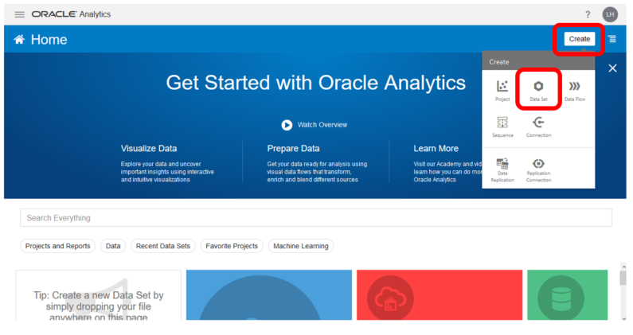
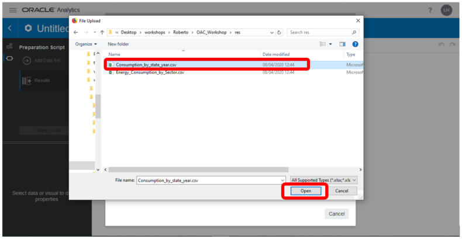

## Lab 1 – Create a Data Set by adding a Spreadsheet from your Computer
You can create a data set from an Excel spreadsheet (XLSX or XLS), CSV file, or TXT file located on your computer. 

_Note:_ You can't import an Excel spreadsheet that contains pivoted data. 

Download the CSV files which contain all the required resources for this section at the following
Links:

1. [CONSUPTION_BY_STATE_YEAR](./res/Consumption_by_state_year.csv)
2. [ENERGY_CONSUMPTION_BY_SECTOR](./res/Energy_Consumption_by_Sector.csv)
3. [ENERGY_EXPENDITURES_HOUSINGUNIT](./res/Energy_expenditures_HousingUnit.xlsx)
4. [ENERGY_EXPENDITURE](./res/Energy_expenditures.xlsx)

And now proceed uploading the following CSV files as a new Data Set on OAC.

On the Home page, in the top-right of the screen click _Create_, and then click _Data Set_.

Click _Drop data file_ here or _click to browse_ to select an XLSX or XLS (with unpivoted data), CSV, or TXT file. And then click _Open_ to upload and open the selected spreadsheet.

Make any required name, description, or column attribute changes.

Click _Add_ to create the data set.