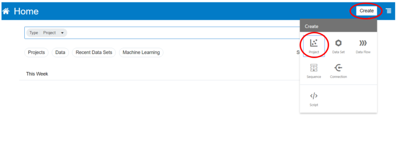
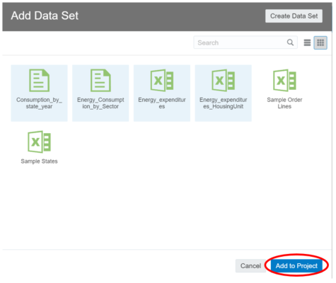
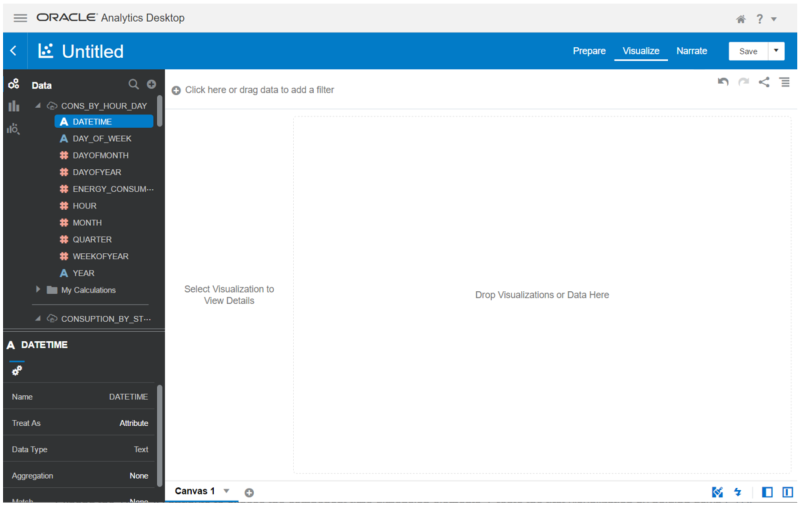
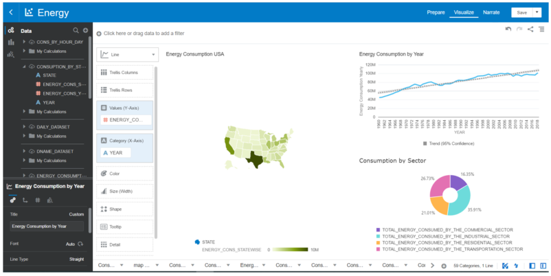
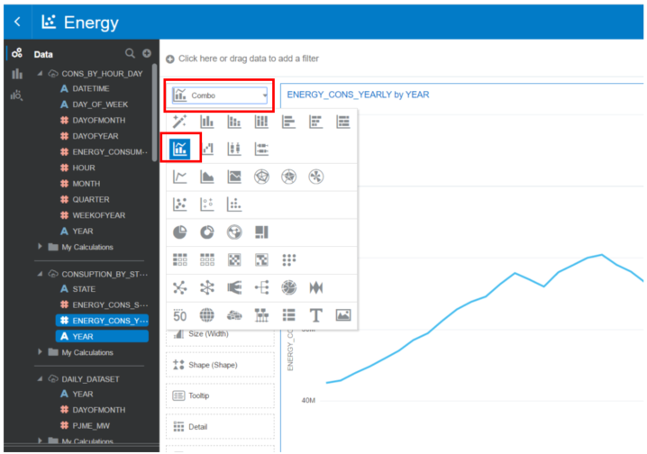
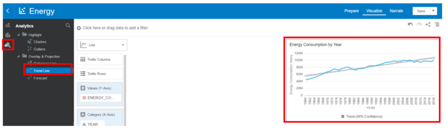
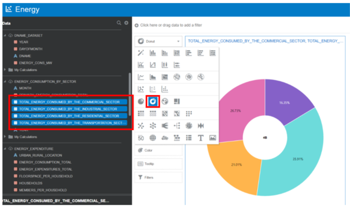
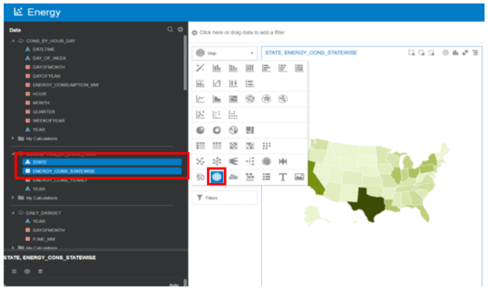

## Lab 2 - Create a simple data visualization project with Oracle Analytics Cloud with multiple Canvases

## Introduction
In this part of the lab, we will create basic interactive canvases within a single project. You will see how easy and powerful you can gain insights and visualize your data in just a few clicks. 

In this part of the lab, we will create basic interactive canvases within a single project. You will see how easy and powerful you can gain insights and visualize your data in just a few clicks. 

You will create a basic interactive dashboard with 3 canvases that summarize:
- Overview Dashboard
- Energy Consumption by Location
- Energy Consumption by type of housing.

On the left corner select the Create button and select _Project_

Then select all the data sources previously uploaded while keeping pressed the ctrl button (or command on MAC) and select the button _Add to Project._

Select on the pop-up windows all the Data Set created previously and then select the button _Add to Project._

Once you created the new project, this is your new blank canvas.

## Canvas 1
Question answered in this section:
1. How does evolve annual Energy Consumption in the USA during the last 60 years?
2. Which are the top three sectors in consumption?
3. How is spread Consumption Energy statewide?

We will create the following canvas using different charts to answer these questions.

- Graph 1 – Annual Energy Consumption by year

On this blank canvas, it is possible to create visualizations by simply drag and drop. Under the table CONSUPTION_BY_STATE_YEAR we can create our first visualization by holding down CTRL and multi-selecting YEAR and ENERGY_CONS_YEARLY attributes. Drag those 2 fields from the left navigation panel to the center blank canvas. A suggested plot is created automatically. From the chart icon at the top left change the chart type to a combo chart. 

Furthermore, is possible to add analytics tools as a trend, reference and forecast line for example. In our canvas, we will use a trend line. After selecting the analytics button by directly drag the trend line over the interested chart it will automatically generate the linear trend line.

- Graph 2 – Total Energy consumption by Sector 

Under the table ENERGY_CONSUMPTION_BY_SECTOR, holding down CTRL and multi-selecting TOTAL_ENERGY_CONSUMED_BY_THE_COMMERCIAL_SECTOR, TOTAL_ENERGY_CONSUMED_BY_THE_INDUSTRIAL_SECTOR, TOTAL_ENERGY_CONSUMED_BY_THE_RESIDENTIAL_SECTOR,
TOTAL_ENERGY_CONSUMED_BY_THE_TRANPORTATION_SECTOR

and right-click on those 4 fields. Select as a chart type a donut chart. The result should be a canvas which contains both the graphs in the same window.

- Graph 3 – Energy Consumption in the USA

Under the table CONSUPTION_BY_STATE_YEAR, holding down CTRL and multi-selecting STATE and ENERGY_CONS_STATEWISE. Right-Click on these 2 fields and select Pick Visualization. From the chart icon at the top left change the chart type to a map chart. Here is showed the yearly total consumption for each state in the USA.

Every chart in the canvas can be moved and dimensioned in the canvas tab as we prefer, to model a custom dashboard. Through this dashboard, we can easily answer questions such as those at the beginning of this paragraph. As showed in _graph 1_ the yearly consumption of energy has constantly increased until the year 2000 and then it holds values in a range between 95M and 102M.