# Lab 3 – Machine Learning

You can use machine learning to make predictions using your existing data.

In this lab, we are going to predict the production of energy from wind through a linear model algorithm. Download the following zip folder which contains all the required resources for training and testing the model.

Download the CSV files which contain all the required resources for this section at the following
links: 

1. [WDAVG (data for training the model)](./res/wdavg.xlsx)
2. [ENERGY_TEST (data for testing the model)](./res/energy_test.xlsx)

## Step 1: Create and Train a Model using a Data Flow

At the Home page, click Create and select Data Flow to display the Add Data Set pane. 

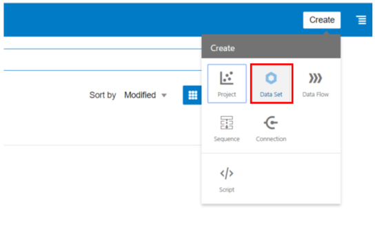

Upload both the data sets that you have downloaded at the beginning of this lab. Replicate the same steps explained in Lab 1 - _Create a Data Set by adding a Spreadsheet from your Computer._

Just for remember, on the Home page, in the top-right of the screen click _Create_, and then click _Data Set_.

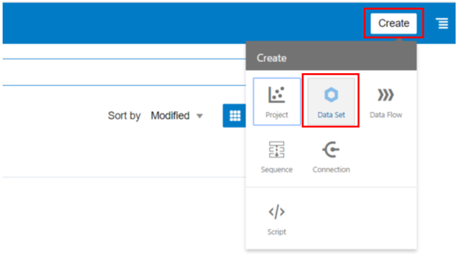

Click _Drop data file here or click to browse_ to select an XLSX or XLS (with unpivoted data), CSV, or TXT file. And then click Open to upload and open the selected spreadsheet.

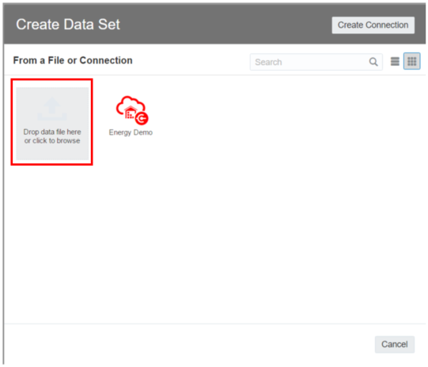

Make any required name, description, or column attribute changes.

Once uploaded the data, always from the home page click _Create_ and then select _Data Flow_ and choose for training the model the wdavg data set then click _Add_.

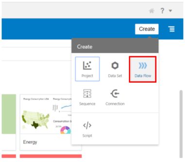

By clicking on the + next to the data set name, it will display all available data flow step options, including train model types (for example, Train Numeric Predictions, Train Multi-Classifier and so on). For this lab, we will select the _Train Numeric Prediction._

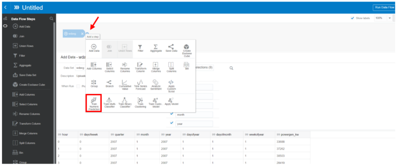

Select for this workshop the _Linear Regression for model training_ as an algorithm.

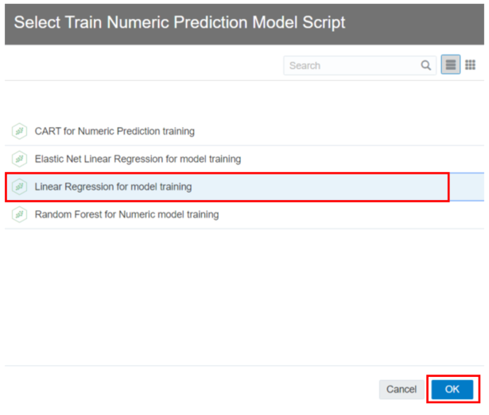

click on the Target field to select a Data Set column that you want to apply to train the model.
We want to predict the power generated from the wind so select the powergen_kw column and let all the other fields as default.

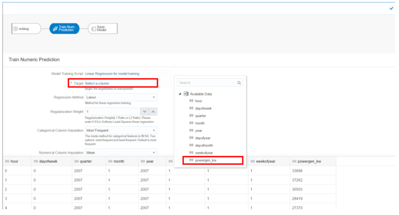

Click the Save Model step in the workflow, then provide a name and click _Run Data Flow._

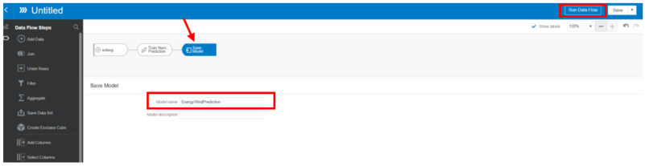

Provide a name for the Data Flow and click on _Save & Run_. At this point, we are creating and training the model. This process takes about 5 minutes to complete.

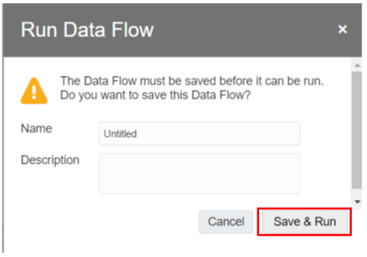

## Step 2: Verify Parameters and Model Quality

Only after, the model completes its training process, we can move to check the parameters and the model quality. From the main page click on the top right to access the main menu and then select _Machine Learning._

Click on the options button positioned in line with the model just created.

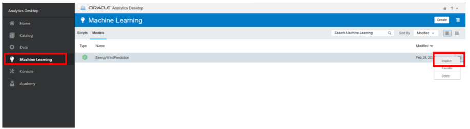

A new window will pop-up and showing all the characteristics of your model. Under the quality, tab are showed important statistical parameters like Coefficient of Determination (R2) and so on.

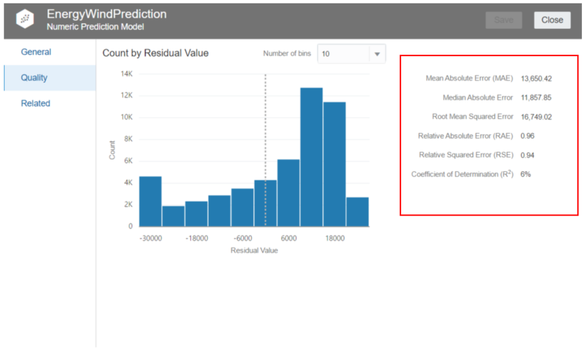

## Step 3: Used the trained Model for Prediction

For predicting future values click on _Create_ and select _Data Flow_.
Choose as Data Set the energy_test one and click _Add_.

Then click on the + button positioned next to the Data Set and select the _Apply Model_ as shown in the picture.

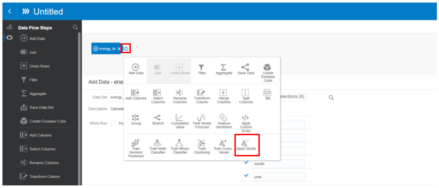

Select the model just created and click ok, and then always by clicking the + button select _Save Data_ for generating a new data set with one column more which contains the predicted values.

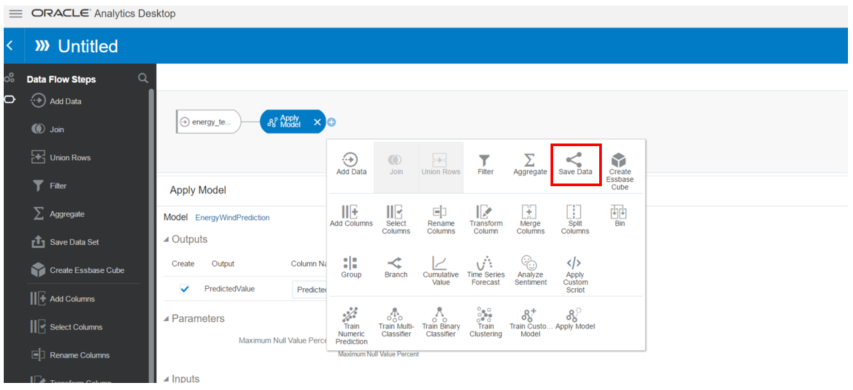

Name the new data set and then click on Run Data Flow. Before naming, the data flow as your preference and then always click _Save & Run_.

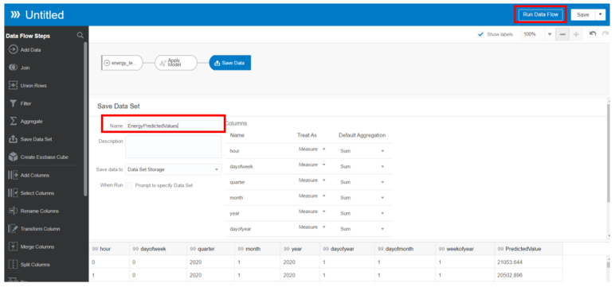

## Step 4: Create a new Dashboard using Predicted Values

Now we want to create another Dashboard utilizing the data just predicted by the algorithm.

From the main menu open the project created in the previous steps, and add a new data set by following the instruction. Under the Visualize tab, we can simply add another data set by clicking on the + positioned on the top left of the screen and select _Add Data Set_...

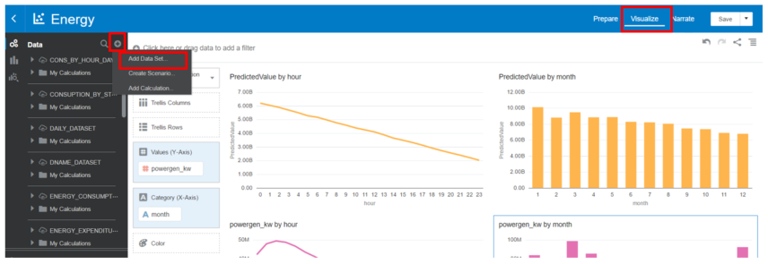

And now select from the pop-up window the Data Set which contains the prediction values calculated. Repeat this same step and for adding the data used for training the model, namely the _wdavg_ dataset.

Before proceeding with the new Dashboard, a few steps to adjust the data, in these two new data sets, are required. Under the tab _**Prepare**_,  select the predicted value table and if necessary, change the definition type of data from measures to attribute.

 Therefore, after having checked change the columns _**hour**_ and _**month**_ in this way.

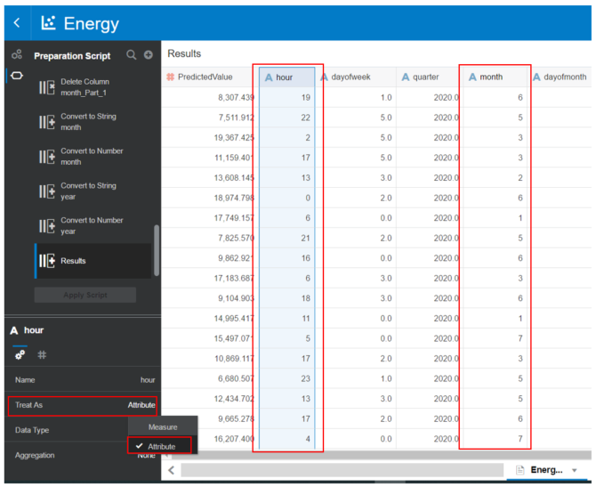

The same process has to been done for the wdavg dataset, always for the columns _**hour**_ and _**month**_.

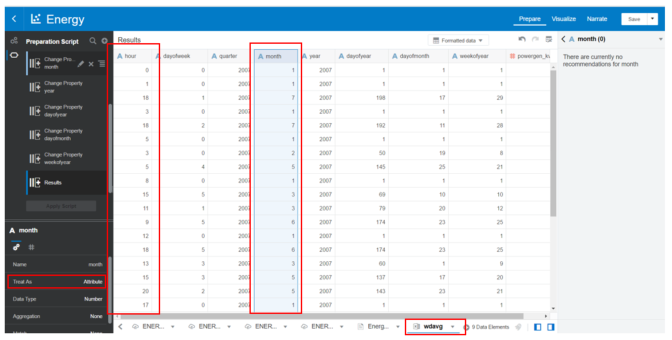

Open now a new blank canvas by clicking on the + symbol in the bottom.

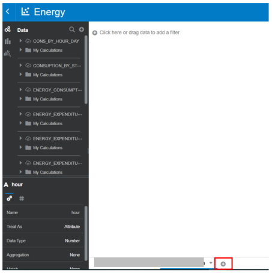

- _Graph 1 – Predicted Values during the daily hour_

Under the table which contains our predicted values we can create a new graph by holding down CTRL and multi-selecting _**PredictedValue**_ and _**hour**_ attributes. Drag those 2 fields from the left navigation panel to the center blank canvas. From the chart icon at the top left change the chart type to a line chart. 

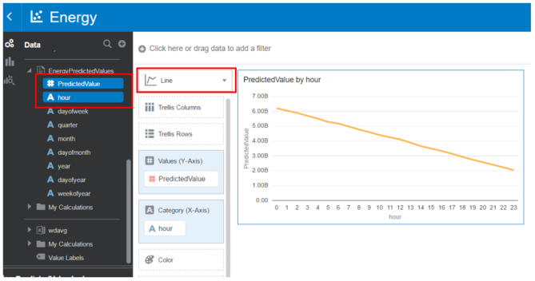

- _Graph 2 – Predicted Values during each month_

Always under the table which contains our predicted values, we can create another graph by holding down CTRL and multi-selecting _**PredictedValue**_ and _**month**_ attributes. Right-click and select _**Pick Visualization**_. From the chart icon at the top left change the chart type to a bar chart. 

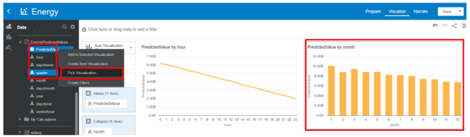

- _Graph 3 – Produced energy for wind hourly from training data_

Under the table wdavg, create a new graph by holding down CTRL and multi-selecting _**Powergen_kw**_ and _**hour**_ attributes. Right-click and select _**Pick Visualization**_. From the chart icon at the top left change the chart type to a line chart. 

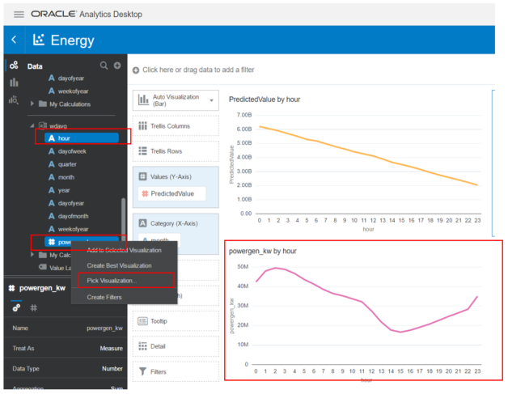

- _Graph 4 – Produced energy for wind monthly from training data_

Under the table wdavg, create a new graph by holding down CTRL and multi-selecting _**Powergen_kw**_ and _**month**_ attributes. Right-click and select _**Pick Visualization**_. From the chart icon at the top left change the chart type to a bar chart. 

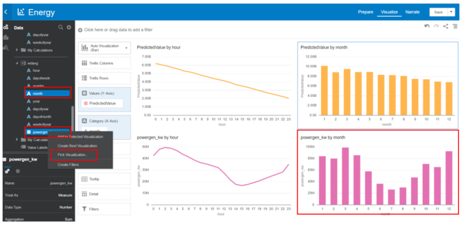
