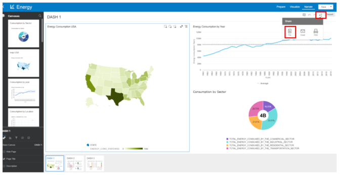
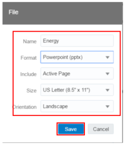

# Lab 4 - How to export Dashboard 

You can export one or more of your project's visualizations, canvases, or stories as a Portable Document Format (PDF), PowerPoint (PPT) file or e-mail.

Select the visualization you want to export and click Menu or right-click and click _Share_, then select As PDF or As PPT. Alte_rnatively, click _Share Project_ on the project toolbar and _select File_. 

Choose the desired export format and all the other options.

Click _Save_ to open the Save File dialog.

In Save File dialog, change the file name, making sure to include the file extension, and browse to the location where you want to save the file.